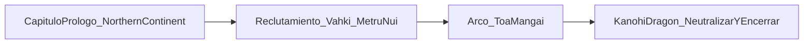
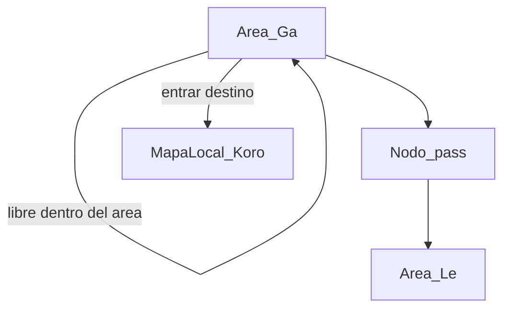

# ABA-I — Intenciones de diseño e historia

**Nombre completo:** A Bionicle Adventure I  
**Documento de autoría:** el dueño del proyecto define misiones, ítems, personajes, locaciones y beats narrativos. Este archivo fija el marco; **no** inventa el detalle de contenido.

---

## Premisa

Adaptación (no reproducción literal) del arco de los **Toa Mangai**, centrada en principio en **Toa Lhikan** (con la intención de poder jugar otros Toa más adelante).

**Arco largo previsto:** desde el reclutamiento (vinculado a **Vahki**) para proteger **Metru Nui**, hasta neutralizar y encerrar al **Kanohi Dragon**.

**Primera instancia a desarrollar:** un **capítulo inicial previo al reclutamiento** — una misión en la isla conocida como **Northern Continent** (mapa: [`content/design/PROLOGUE_MAP.md`](content/design/PROLOGUE_MAP.md); misiones: [`PROLOGUE_QUESTS.md`](content/design/PROLOGUE_QUESTS.md); personajes: [`PROLOGUE_CHARS.md`](content/design/PROLOGUE_CHARS.md)).

---

## Enfoque respecto al lore oficial

- **Prioridad:** adaptar la obra original **lo más fiel posible**.
- **Licencias creativas:** donde el canon tenga **huecos**, ambigüedades o **inconsistencias**, el autor puede rellenar y hacer cambios **mínimos** para que el juego y la narración cierren.
- Eso no es un “reboot libre”: el default es canon; la inventiva entra solo donde hace falta.

---

## Quién diseña qué

| Área | Quién decide |
|------|----------------|
| Historia, beats, diálogos, nombres propios de misiones | **Autor** |
| Locaciones (Wahi, Koro, POI), NPCs, coleccionables | **Autor** |
| Qué Kanohi existen en cada acto y cómo se obtienen | **Autor** |
| Sistemas técnicos (inventario, flags, grafo Main, mapas, búsqueda) | Código / hobbie técnico, **alimentado por datos del autor** |
| Lore Bionicle de fondo (Toa, Matoran, Kanohi, etc.) | Se asume conocido; no hace falta reexplicarlo salvo fanon o desviaciones al canon |

**Regla para agentes/IA:** no inventar misiones, ítems, personajes ni locaciones “para rellenar”. Proponer solo cuando se pida, y siempre como borrador sujeto a aprobación del autor.

---

## Estructura narrativa de misiones

- **Main:** una **única línea principal** de misiones que lleva el eje de la historia (Lhikan → Mangai → Kanohi Dragon, pasando por el prólogo).
- **“Side missions”:** no como lista paralela clásica de encargos, sino como **eventos repartidos por el mapa** que den vida al mundo (encuentros, hallazgos, pequeñas escenas). Pueden dar recompensas o flags, pero **no deben competir** con la Main como segunda campaña lineal.

---

## Mecánicas clave (requisitos de diseño)

### 1. Kanohi como ítems
- Las **Kanohi** son ítems equipables / usables.
- Cada una otorga un **poder especial** (ejemplos de referencia, no lista cerrada del juego):
  - **Kanohi Huna** — invisibilidad
  - **Kanohi Pakari** — fuerza
  - Otras: las define el autor al diseñar contenido

### 2. Poderes elementales
- Los personajes jugables (Lhikan y, más adelante, otros Toa) tienen **poderes elementales** propios, distintos del sistema Kanohi.

### 3. Mecánica de búsqueda
- Habrá un sistema de **búsqueda** (inspección / rastreo / exploración dirigida).
- Será **crucial** en ciertas misiones Main, en eventos de mapa y en coleccionables.
- El alcance exacto (controles, UI, pistas) se define cuando se implemente; aquí solo queda el requisito.

### 4. Vista
- Vista de juego: **cenital** (decisión de Fase 1).

### 5. Mapas Global y Local

- **Mapa Global (overworld):** muestra el continente/isla actual (en el prólogo: **Northern Continent**). Se recorre por **áreas**; el movimiento es libre **dentro** de un área.
- **Nexos (`pass`):** para pasar de un área a otra hay que usar un nodo nexo accesible (no hay cruce libre entre secciones).
- **Mapa Local:** escena **separada** al entrar a un destino (aldea, suva, POI, etc.); orientación dentro de ese escenario.
- **No es un único sandbox continuo** de todo el continente mezclado con interiores: Global = overworld por áreas; Local = escenas al entrar en nodos destino.
- **Desbloqueo gradual:** nodos no siempre visibles/accesibles al inicio; se revelan / abren con progreso (flags, Main) y/o descubrimiento al acercarse.
- Detalle del prólogo (zonas, **áreas** del Global, nodos, movilidad): [`content/design/PROLOGUE_MAP.md`](content/design/PROLOGUE_MAP.md).

---

## Capítulos (borrador de alcance, sin beats inventados)

| ID | Capítulo | Estado |
|----|----------|--------|
| `ch0_prologue` | Northern Continent — pre-reclutamiento | **Primero a diseñar** (mapa listo; misiones/personajes en docs de diseño) |
| `ch1_recruit` | Reclutamiento / llegada al rol en Metru Nui | Pendiente |
| `ch2_mangai` | Arco Toa Mangai en Metru Nui | Pendiente |
| `ch3_dragon` | Confrontación / encierro del Kanohi Dragon | Pendiente |

Rellenar filas y misiones concretas solo cuando el autor las escriba (p. ej. en `content/` o tablas en este doc).

---

## Notas legales / hobbie

Proyecto personal de hobbie. Bionicle / LEGO son marcas de terceros; esta es una **adaptación fan** no comercial salvo que el autor decida lo contrario más adelante.

---

## Historial de este documento

| Fecha | Cambio |
|-------|--------|
| 2026-07-21 | Primera constancia: Mangai / Lhikan, prólogo Northern Continent, Kanohi + elemental + búsqueda, Main única + eventos de mapa |
| 2026-07-22 | Lore: fidelidad al canon + licencias mínimas en huecos; Mapa Global/Local, viaje solo por nodos, desbloqueo gradual; plantilla Wahi/Koro |
| 2026-08-11 | Mapa Global = overworld por áreas + nexos `pass` (ya no fast travel puro pin→teleporte) |
