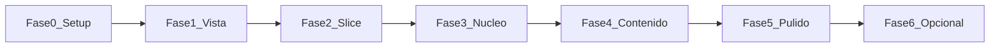

# ABA-I — Planificación por fases

**Stack elegido:** Godot 4.7 + C# (Opción B)  
**Plataforma:** PC (local, sin nube)  
**Idiomas:** Español (por defecto) + inglés  
**Estado actual:** Vertical slice jugable (pueblo, misiones en grafo, diálogo, guardar, prototipos de vista)

Este documento sirve para planificar el trabajo del hobbie por fases. No define la historia: tú la escribes; el código solo consume datos (`content/`, `locales/`).

---

## Cómo usar este plan

1. Trabaja **una fase a la vez**. No saltes a pulido o contenido largo antes de cerrar el núcleo.
2. Cada fase tiene: objetivo, entregables, criterios de “hecho” y tareas.
3. Marca tareas con `[x]` cuando las completes.
4. Si una fase se alarga, recorta alcance (arte temporal está permitido).

---

## Mapa de fases (visión general)

| Fase | Nombre | Objetivo en una frase |
|------|--------|------------------------|
| 0 | Setup | Entorno listo y proyecto abrible |
| 1 | Prototipo de vista | Decidir lateral / cenital / híbrido |
| 2 | Vertical slice | Probar el loop completo en un mapa |
| 3 | Núcleo de juego | Sistemas estables para crecer |
| 4 | Contenido | Historia, misiones, mapas, idiomas |
| 5 | Pulido PC | Controles, opciones, build jugable |
| 6 | (Opcional) Expansión | Steam, pad, más mecánicas… |

**Ya cubierto en el repo:** Fase 0 (base), Fase 1 (prototipos + hybrid por zonas), Fase 2 (slice).  
**Siguiente foco recomendado:** Fase 3.



---

## Fase 0 — Setup *(hecha en gran parte)*

### Objetivo
Tener motor, SDK, repo y carpetas base para iterar sin fricción.

### Entregables
- [x] Godot 4 Mono instalado
- [x] .NET SDK 8 instalado
- [x] Proyecto `ABA-I` con `project.godot` + `ABAI.csproj`
- [x] Git + `.gitignore`
- [x] Estructura `autoload/`, `player/`, `systems/`, `content/`, `locales/`, `maps/`, `ui/`
- [ ] Confirmar que abres el proyecto en el editor y pulsas F5 sin errores

### Criterio de hecho
El juego arranca en el menú principal desde el editor.

### Notas
- Script local: `abrir.ps1`
- Alias winget: `godot` / `godot_console` (puede requerir reiniciar la terminal)

---

## Fase 1 — Prototipo de vista *(hecha; decisión pendiente de validar jugando)*

### Objetivo
Probar movimiento lateral y cenital y **decidir** la vista definitiva (o el híbrido).

### Entregables
- [x] Prototipo lateral (`maps/PrototypeSide.tscn`)
- [x] Prototipo cenital (`maps/PrototypeTopDown.tscn`)
- [x] Soporte de modos `Side` / `TopDown` desacoplado de misiones
- [x] Hybrid de prueba por zonas en `Village` (bolsa sur = plataformas)
- [ ] Jugar 30–60 min y decidir una de estas opciones:

| Decisión | Descripción |
|----------|-------------|
| A. Solo lateral | Explorar y combatir/saltar en side-scroller |
| B. Solo cenital | Exploración top-down tipo aventura |
| C. Híbrido por zonas *(actual)* | Un modo por área (`CameraModeZone`) |
| D. Híbrido en la misma zona | Cambiar modo con input/trigger (más complejo) |

### Criterio de hecho
Decisión escrita abajo (rellena tú):

```text
Decisión de vista: _______________________
Fecha: ___________
Motivo: _______________________________
```

### Tareas de cierre
- [ ] Anotar la decisión en este archivo
- [ ] Si eliges A o B: simplificar Village (quitar zonas del modo no usado)
- [ ] Si eliges C: mantener `CameraModeZone` y diseñar mapas pensando en “bolsas” de modo
- [ ] Si eliges D: planificar input de cambio de modo + reglas de física al cambiar

---

## Fase 2 — Vertical slice *(hecha)*

### Objetivo
Probar el **loop**: explorar → misión → progreso → diálogo → guardar, sin arte final ni historia final.

### Entregables
- [x] Menú: nueva / cargar / idioma / salir + accesos a prototipos
- [x] Mapa pueblo con NPC + marcador
- [x] Grafo de 3 misiones en `content/quests/quests.json`
- [x] Diálogo por claves i18n
- [x] Guardado local (`user://save_slot_0.json`)
- [x] HUD de misiones + modo de cámara
- [ ] Jugar el slice de principio a fin una vez en ES y una en EN

### Criterio de hecho
Completar las 3 misiones, guardar, salir, cargar y seguir viendo el progreso.

### Checklist de prueba manual
- [ ] Nueva partida → hablar con el guía
- [ ] Ir al mirador verde del norte
- [ ] Volver a hablar con el guía
- [ ] Esc → Guardar → Menú → Cargar
- [ ] Cambiar idioma en menú o pausa y ver textos actualizados

---

## Fase 3 — Núcleo de juego *(siguiente)*

### Objetivo
Dejar sistemas **estables y escalables** para que añadir contenido sea casi solo datos y mapas.

### 3.1 Inventario mínimo
- [ ] Definir datos de ítem (`content/items/*.json` o recurso)
- [ ] Conectar `systems/Inventory.cs` al guardado
- [ ] Pickup en mapa + mostrar en HUD o menú simple
- [ ] Objetivo de misión tipo `collect` (opcional pero útil)

### 3.2 Interactables genéricos
- [ ] Extraer patrón reutilizable: puertas, cofres, señales, NPCs
- [ ] Triggers que escriben `WorldFlags` sin hardcodear misiones
- [ ] Zona / puerta bloqueada por flag

### 3.3 Diálogo con ramas
- [ ] Formato de diálogo en datos (JSON) con opciones
- [ ] Condiciones por flags (`if flag X → línea Y`)
- [ ] Mantener textos solo en `locales/strings.csv` (o CSV partido por actos)

### 3.4 Múltiples mapas y transición
- [ ] Segundo mapa (ej. “bosque” o “casa”)
- [ ] Portal / puerta entre mapas con spawn point
- [ ] Guardar `scene` + posición (ya existe base en `SaveSystem`)
- [ ] Evitar perder estado de quests al cambiar de escena

### 3.5 UI de opciones in-game
- [ ] Volumen (aunque sea un slider dummy o master)
- [ ] Idioma (ya hay toggle; mejorarlo a selector ES/EN)
- [ ] Pantalla completa / ventana (preparar para Fase 5)

### 3.6 Calidad de código (ligero)
- [ ] Revisar que ningún string de UI esté hardcodeado
- [ ] Documentar en comentarios cortos los IDs de flags usados
- [ ] Mantener misiones fuera del código C#

### Criterio de hecho
Puedes crear un ítem, una puerta por flag, un segundo mapa y un diálogo con 2 ramas **sin** reescribir `PlayerController` ni el grafo de quests.

### Orden sugerido dentro de Fase 3
1. Transición entre mapas  
2. Puertas / flags  
3. Inventario + pickup  
4. Diálogo con ramas  
5. UI de opciones  

---

## Fase 4 — Contenido

### Objetivo
Llenar el juego con **tu** historia, misiones y exploración, reutilizando el núcleo.

### 4.1 Diseño de contenido (antes de producir mucho)
- [ ] Lista de zonas / mapas (nombres internos, no hace falta lore público)
- [ ] Grafo de misiones principales (IDs + dependencias)
- [ ] Misiones secundarias opcionales (exploración)
- [ ] Lista de flags globales (`met_x`, `door_y_open`, `act1_done`…)
- [ ] Glosario de claves `locales` (`dialog.*`, `quest.*`, `ui.*`)

### 4.2 Producción por “paquetes”
Trabaja en paquetes pequeños (1 mapa + 2–4 misiones + diálogos ES/EN):

| Paquete | Mapa | Misiones | Diálogos | Hecho |
|---------|------|----------|----------|-------|
| P1 | | | | [ ] |
| P2 | | | | [ ] |
| P3 | | | | [ ] |
| P4 | | | | [ ] |

### 4.3 Arte y audio (cuando haga falta)
- [ ] Decidir estilo (pixel art, shapes placeholder, etc.)
- [ ] Sustituir `ColorRect` del player/NPC por sprites
- [ ] Tileset o colliders limpios por mapa
- [ ] (Opcional) música / SFX básicos

### 4.4 Localización
- [ ] Cada clave nueva en ES **y** EN el mismo día
- [ ] Pasada de revisión de EN (aunque sea borrador)
- [ ] Evitar texto partido que no se pueda traducir bien

### Criterio de hecho
Un jugador puede recorrer varias zonas, completar un arco de misiones no 100 % lineal y cambiar idioma sin romper la historia.

### Regla de oro
Si para añadir una misión tienes que tocar 5 scripts C#, el núcleo aún no está listo: vuelve a Fase 3.

---

## Fase 5 — Pulido PC

### Objetivo
Que se sienta un juego instalable/jugable en Windows, aunque sea en zip.

### Controles y feel
- [ ] Rebalancear velocidad / salto
- [ ] Deadzones y teclado + gamepad (Godot InputMap)
- [ ] Feedback al interactuar (prompt `[E]`, sonido, highlight)

### Opciones
- [ ] Resolución / pantalla completa
- [ ] Idioma persistente entre partidas
- [ ] Volumen master/música/SFX
- [ ] Rebind básico (opcional)

### Estabilidad
- [ ] Probar guardar/cargar en distintos mapas
- [ ] No perder quests/flags al morir / reiniciar zona (si aplica)
- [ ] Pantalla de créditos / salir limpio

### Build
- [ ] Export preset Windows (Godot Export)
- [ ] Carpeta `builds/` o zip portable
- [ ] Probar el build en una máquina/ruta limpia

### Criterio de hecho
Un zip + `.exe` abre, carga, guarda y se juega un tramo de 15–30 min sin abrir el editor.

---

## Fase 6 — Expansión opcional *(solo si apetece)*

No es requisito del hobbie. Elige como máximo 1–2 ítems:

- [ ] Página Steam / build demo
- [ ] Más slots de guardado
- [ ] Combate simple
- [ ] Crafting / economía
- [ ] Mapa del mundo (UI)
- [ ] Logros locales
- [ ] Modo accesibilidad (texto grande, daltonismo)

---

## Rituales de trabajo (recomendados)

### Sesión corta (45–90 min)
1. Elige **una** tarea de la fase activa  
2. Implementa o escribe datos  
3. Prueba en el editor (F5)  
4. Marca el checkbox  

### Sesión de contenido
1. Añade/ajusta entradas en `quests.json`  
2. Añade claves en `strings.csv` (ES + EN)  
3. Coloca NPC / markers en el mapa  
4. Juega el camino feliz + un desvío  

### Antes de dar por cerrada una fase
- [ ] Checklist de la fase en verde  
- [ ] No hay strings hardcodeados nuevos en UI  
- [ ] Guardar/cargar sigue funcionando  

---

## Inventario técnico actual (referencia rápida)

| Pieza | Ubicación |
|-------|-----------|
| Flags de mundo | `autoload/WorldFlags.cs` |
| Misiones (grafo) | `autoload/QuestManager.cs` + `content/quests/quests.json` |
| Guardado | `autoload/SaveSystem.cs` |
| i18n | `autoload/Locale.cs` + `locales/strings.csv` |
| Modo cámara | `autoload/CameraModeService.cs` + `systems/CameraModeZone.cs` |
| Jugador | `player/PlayerController.cs` |
| Diálogo UI | `systems/DialogueUI.cs` |
| Menú / pausa / HUD | `ui/` |
| Slice | `maps/Village.tscn` |

---

## Backlog vivo (ideas sin fecha)

Anota aquí lo que surja, sin obligarte:

- 
- 
- 

---

## Historial de decisiones

| Fecha | Decisión | Motivo |
|-------|----------|--------|
| 2026-07-15 | Stack = Godot 4 + C# (Opción B) | Tipado + motor ligero para hobbie |
| 2026-07-15 | Vertical slice híbrido por zonas | Probar ambos modos sin reescribir misiones |
| | Vista definitiva = ___ | |

---

## Próximo paso concreto

1. Completar la **checklist de prueba** de Fase 2.  
2. Escribir la **decisión de vista** en Fase 1.  
3. Empezar Fase 3 por **transición a un segundo mapa**.
